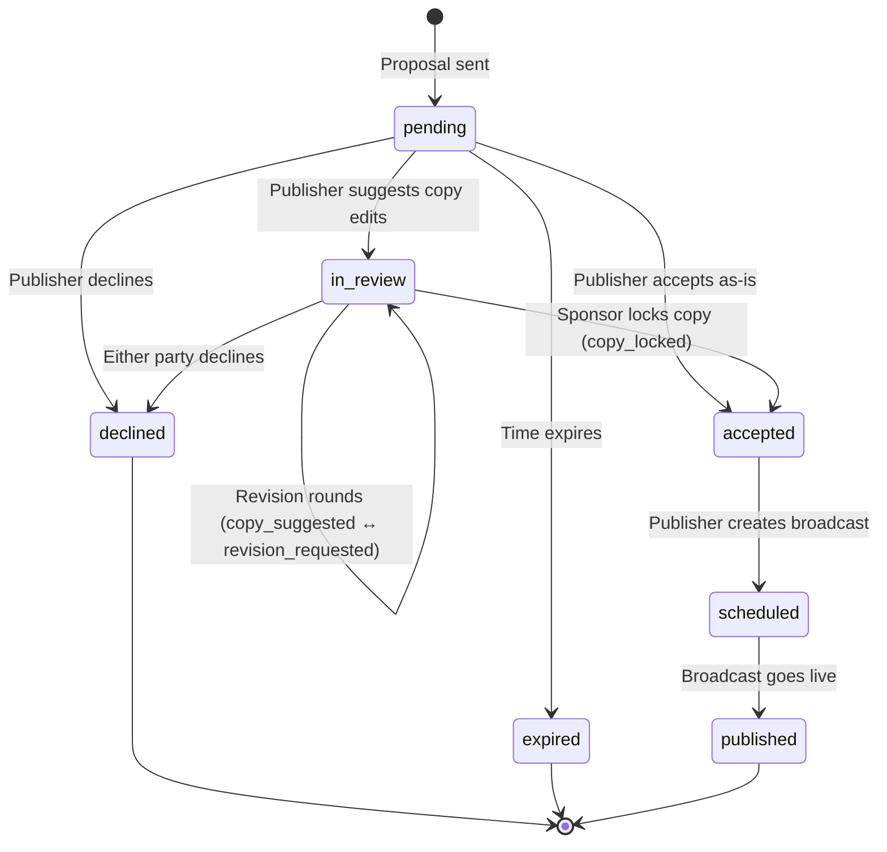

# Architecture

## Tech Stack

| Layer | Technology | Version |
|-------|-----------|---------|
| Framework | Next.js (App Router) | 16.1.6 |
| UI Library | React | 19.2.3 |
| Language | TypeScript | ^5 |
| Styling | Tailwind CSS v4 | ^4 |
| Components | shadcn/ui (radix-vega style) | ^3.8.5 |
| Icons | Phosphor Icons | ^2.1.10 |
| Tables | TanStack React Table | ^8.21.3 |
| Toasts | Sonner | ^2.0.7 |

---

## Project Structure

```
kajabi-amplify-prototype/
├── app/
│   ├── layout.tsx              # Root layout (fonts, providers)
│   ├── page.tsx                # Prototype index (4 demo entry points)
│   ├── globals.css             # Tailwind v4 theme + color tokens
│   ├── onboarding/
│   │   ├── layout.tsx          # Minimal layout (no nav)
│   │   └── page.tsx            # Multi-step onboarding flow
│   └── (app)/
│       ├── layout.tsx          # App shell (nav + content area)
│       ├── home/
│       │   ├── page.tsx        # Server component wrapper
│       │   └── home-content.tsx # Dashboard with role-based content
│       ├── requests/
│       │   ├── page.tsx        # Server component wrapper
│       │   ├── requests-content.tsx # Tabbed request list
│       │   └── [id]/
│       │       ├── page.tsx    # Server component wrapper
│       │       └── request-detail-content.tsx # Timeline + actions
│       ├── profile/
│       │   └── [id]/
│       │       ├── page.tsx    # Server component wrapper
│       │       └── profile-content.tsx # Publisher/sponsor profiles
│       ├── settings/
│       │   ├── page.tsx        # Server component wrapper
│       │   └── settings-content.tsx # Tabbed settings form
│       ├── dashboard/page.tsx  # Redirect → /home
│       ├── directory/page.tsx  # Redirect → /home
│       └── payments/page.tsx   # Redirect → /settings
├── components/
│   ├── ui/                     # shadcn/ui primitives (see system.md)
│   ├── app-nav.tsx             # Top nav + mobile bottom tabs
│   ├── email-block-preview.tsx # Ad unit preview in email context
│   ├── engagement-badge.tsx    # "High engagement" indicator
│   ├── hero-card.tsx           # Creator profile card + identity block
│   ├── page-header.tsx         # Page title + description
│   ├── payout-badge.tsx        # Formatted dollar amount display
│   ├── request-action-card.tsx # Context-aware action buttons
│   ├── request-sidebar.tsx     # Other-party info panel
│   ├── revenue-calculator.tsx  # Projected earnings calculator
│   ├── social-icon.tsx         # Platform icon mapper
│   ├── sponsor-card.tsx        # Sponsor profile card with actions
│   ├── stat-card.tsx           # Single metric display
│   └── timeline-event.tsx      # Timeline + copy editing UI
├── lib/
│   ├── mock-data.ts            # Types, mock data, helper functions
│   ├── generated-heroes.ts     # Generated hero/sponsor mock data arrays
│   ├── seed-promotions.ts      # Generated promotion request mock data
│   ├── date.ts                 # Date formatting utilities
│   └── utils.ts                # cn(), buildPersonaParams(), stripProtocol()
├── .interface-design/
│   └── system.md               # Design system reference
└── docs/                       # This documentation
```

---

## Routing

All app routes live under the `(app)` route group, which provides the shared navigation shell.

| Route | Description |
|-------|-------------|
| `/` | Prototype index — 4 cards linking to demo personas |
| `/onboarding` | Multi-step onboarding (sign-in → profile → role → path-specific setup) |
| `/home` | Role-based dashboard (stats, activity, recommendations) |
| `/requests` | Promotion request list with status tabs |
| `/requests/[id]` | Request detail with timeline, copy editing, and action card |
| `/profile/[id]` | Hero profile — layout differs for publisher vs sponsor |
| `/settings` | Settings with vertical tabs (Profile, Pricing/Campaign, Account) |
| `/dashboard` | Redirects → `/home` |
| `/directory` | Redirects → `/home` |
| `/payments` | Redirects → `/settings` |

**Pattern:** Each route uses a thin server component (`page.tsx`) that wraps a client component (`*-content.tsx`) in a `<Suspense>` boundary. This lets the server component handle the page shell while the client component manages URL state via `useSearchParams()`.

---

## Data Model

All types are defined in `lib/mock-data.ts`. There is no database — everything is in-memory mock data.

### Hero

Represents any user on the platform (publisher, sponsor, or both).

```typescript
interface Hero {
  id: string
  name: string
  avatar: string
  role: Role                    // "publisher" | "sponsor" | "both"
  tagline: string
  verticals: Vertical[]         // Niche categories (typically 2 per hero)
  subscriberCount: number
  engagementTier: EngagementTier // "high" | "medium" | "low"
  openRate: number              // Email open rate %
  clickRate: number             // Email click rate %
  recommendedFee: number        // Per-send fee in dollars
  budgetPerThousand?: number    // Sponsor: budget per 1k subscribers
  maxBudget?: number            // Sponsor: max budget cap
  bio: string
  website: string
  socialLinks: { platform: string; url: string }[]
  promotionsCompleted: number
  rating: number
  joinedDate: string
}
```

**Note:** Each hero typically has 1–2 verticals. The design intent is one primary niche per hero, but the prototype data includes secondary categories for recommendation matching.

### PromotionRequest

A promotion negotiation between a sponsor and publisher.

```typescript
interface PromotionRequest {
  id: string
  sponsorId: string
  publisherId: string
  status: RequestStatus
  initiatedBy: "sponsor" | "publisher"
  brief: string                 // Sponsor's product/offer description
  adHeadline: string
  adBody: string
  adCta: string
  adCtaUrl: string
  adImage?: string
  proposedFee: number
  notes: string
  reviewTurn?: "sponsor" | "publisher"
  proposedEdits?: CopySnapshot
  revisionNotes?: string
  scheduledAt?: string
  createdAt: string
  updatedAt: string
  timeline?: TimelineEvent[]
}
```

### TimelineEvent

A single event in the promotion workflow.

```typescript
interface TimelineEvent {
  id: string
  type: TimelineEventType
  actorId: string
  timestamp: string
  note?: string
  copyBefore?: CopySnapshot     // Previous copy version
  copyAfter?: CopySnapshot      // Updated copy version
  metadata?: Record<string, string>
}
```

**Event types:** `proposal_sent`, `accepted`, `declined`, `copy_suggested`, `revision_requested`, `copy_locked`, `broadcast_created`, `scheduled`, `published`, `expired`

### CopySnapshot

A point-in-time version of ad copy.

```typescript
interface CopySnapshot {
  adHeadline: string
  adBody: string
  adCta: string
  adCtaUrl: string
}
```

### PayoutEstimate

Calculated earnings for a promotion.

```typescript
interface PayoutEstimate {
  amount: number
  ratePerK: number
  maxPayout: number | undefined
  audienceSize: number
  capped: boolean               // True if amount hit maxBudget
}
```

### Supporting Types

```typescript
type Role = "publisher" | "sponsor" | "both"
type EngagementTier = "high" | "medium" | "low"
type RequestStatus = "pending" | "accepted" | "in_review" | "scheduled"
                   | "published" | "declined" | "expired"
type Vertical = "Health & Fitness" | "Business & Marketing" | "Personal Development"
              | "Creative Arts" | "Finance" | "Parenting" | "Technology"
              | "Education" | "Lifestyle"
```

---

## State Management

No global state store. The prototype uses two patterns:

### URL Query Parameters

Role and view context persist across navigation via query params.

| Param | Values | Purpose |
|-------|--------|---------|
| `role` | `publisher`, `sponsor`, `both` | Active demo persona |
| `view` | `publisher`, `sponsor` | View override when `role=both` |
| `tab` | varies by page | Active tab in tabbed sections |
| `new` | `true` | Shows onboarding callout on home |

`buildPersonaParams()` in `lib/utils.ts` constructs the query string and is used on every internal link to preserve context.

### Local Component State

Each page manages its own state with `useState`. The request detail page is the most stateful — it tracks:
- Current status and timeline (for real-time UI updates on actions)
- Dialog open/close states (decline, approve, edit)
- Inline copy editing state (before/after snapshots)

All mock data is imported directly from `lib/mock-data.ts`. Functions like `getRequestsForUser()` and `getRecommendedHeroes()` filter the in-memory arrays.

---

## Request Status Flow



**Key mechanics:**
- **Copy editing** happens during `in_review`. Publisher suggests edits → sponsor reviews → either locks copy or requests revision.
- **`deriveRequestState()`** walks the timeline array to compute: current copy, whether copy is locked, revision round count, and whose turn it is.
- **`whoseTurn`** drives the action card — only the party whose turn it is sees action buttons.

---

## Key Helper Functions

All exported from `lib/mock-data.ts` unless noted.

| Function | Purpose |
|----------|---------|
| `deriveRequestState(request)` | Walks timeline to compute `currentCopy`, `copyLocked`, `revisionRound`, `whoseTurn`, `lastActorId` |
| `calculatePayout(sponsor, publisher)` | `sponsor.budgetPerThousand × publisher.subscriberCount / 1000`, capped at `maxBudget` |
| `getDisplayStatus(request, viewerRole)` | Direction-aware status labels — pending shows "New" (incoming) vs "Requested" (outgoing) |
| `getRequestsForUser(userId, roleFilter)` | Filters promotion requests by user ID and role |
| `getRecommendedHeroes(forRole, activeUser)` | Finds heroes with matching verticals, sorted by relevance |
| `getRecommendedFee(subscriberCount, openRate)` | Calculates fee rounded to nearest $25 |
| `formatCurrency(amount)` | Formats as `"$1,500"` |
| `formatNumber(num)` | Formats with K/M suffixes |
| `getStatusColor(status)` | Returns Tailwind class string for status badges |
| `getEngagementColor(tier)` | Returns Tailwind class string for engagement badges |
| `buildPersonaParams(persona, view, role)` | Builds `?role=...&view=...` query string (in `lib/utils.ts`) |
| `formatDateShort(dateStr)` | Returns `"Jan 5"` format (in `lib/date.ts`) |
| `formatDateFull(dateStr)` | Returns `"Jan 5, 2025"` format (in `lib/date.ts`) |
